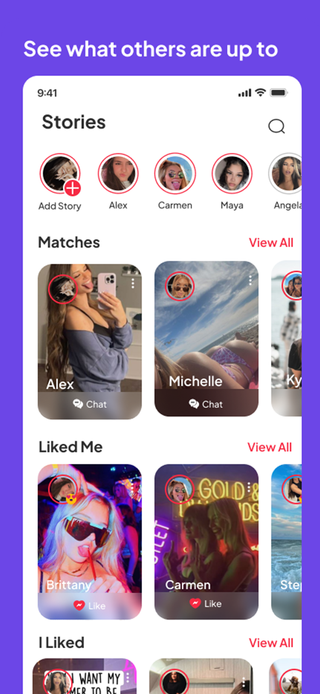
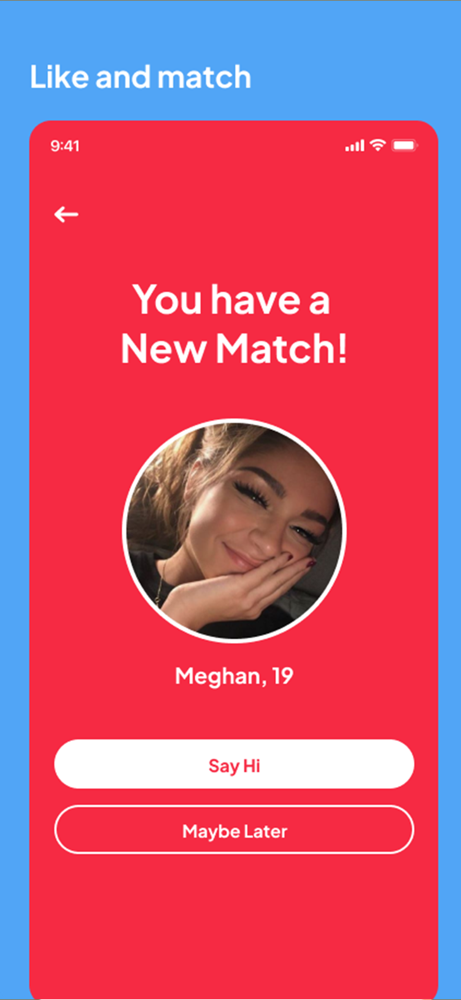
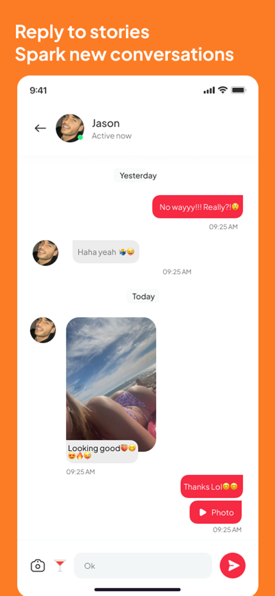

# 🚀 Streax

A modern and sleek Flutter dating app designed to help users connect based on shared interests, location, and curated profiles. Built with scalability, performance, and clean architecture in mind.

> 💡 Designed for both iOS and Android using Flutter with clean UI, real-time chat, and smart match logic.

## 📲 Download the App

- ▶️ [Google Play Store]([https://play.google.com/store/apps/details?id=com.example.datingapp](https://play.google.com/store/apps/details?id=com.nextmedia.streax&hl=en_IN&pli=1))
- 🍎 [Apple App Store]([https://apps.apple.com/app/id1234567890](https://apps.apple.com/in/app/streax-stories-streaks-date/id6654905433))

---

## 🖼️ Screenshots

| Connections | Matches | Chat |
|------------|---------|------|
|  |  |  |

---

## ✨ Features

- 🧬 Smart Matching Algorithm
- 📍 Geolocation-based Match Discovery
- 💬 Real-time Chat (Socket-based)
- 🔐 Profile Verification UI
- 🖼️ Swipe UI for Profiles (Tinder-like)
- 📂 Clean Folder Structure & Modular Code
- 
---

## 🔧 Tech Stack

- **Flutter** (v3.x) – Cross-platform mobile development
- **State Management**: [GetX ]
- **Authentication**: Custom API
- **Backend Ready**: Firebase / REST API
- **Push Notifications**: Firebase Cloud Messaging
- **Other Tools**: Google Maps, Image Picker, Cached Network Image

---

